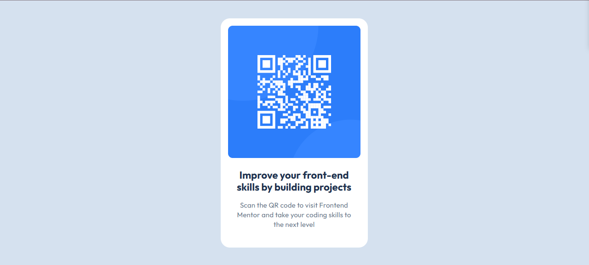

# Frontend Mentor - QR code component solution

This is a solution to the [QR code component challenge on Frontend Mentor](https://www.frontendmentor.io/challenges/qr-code-component-iux_sIO_H). Frontend Mentor challenges help you improve your coding skills by building realistic projects.

## Table of contents

- [Overview](#overview)
  - [Screenshot](#screenshot)
  - [Links](#links)
- [My process](#my-process)
  - [Built with](#built-with)
  - [What I learned](#what-i-learned)
  - [Continued development](#continued-development)
  - [Useful resources](#useful-resources)
- [Author](#author)
- [Acknowledgments](#acknowledgments)

## Overview

### Screenshot



### Links

- Solution URL: [solution URL here](https://github.com/ernur-burshak/qr-code-component/tree/main)
- Live Site URL: [live site URL here](https://ernur-burshak.github.io/qr-code-component/)

## My process

### Built with

- Semantic HTML5 markup
- CSS custom properties
- Flexbox
- Mobile-first workflow

### What I learned

```html
<main class="container"></main>
```

```html
<section class="container-text"></section>
```

```css
body {
  height: 100vh; /* Устанавливаем высоту на всю высоту экрана */
}
```

```css
.container {
  box-sizing: border-box;
  flex-direction: column; /* элементы располагаются вертикально */
  gap: 24px; /* вертикальный промежуток между элементами */
}
```

```css
.container-qr-image {
  background-position: center;
}
```

```css
.text {
  line-height: 140%; /* Межстрочный интервал 140% */
  letter-spacing: 0.2px; /* Расстояние между буквами 0.2px */
  height: auto; /* Высота подстраивается под содержимое */
}
```

### Continued development

- CSS Grid
- Bootstrap

### Useful resources

- [Practice Page](https://www.frontendmentor.io/) - helped me start an internship in a Frontend development career.
- [Font](https://fonts.googleapis.com/css2?family=Outfit:wght@400;700&display=swap) - I found the necessary font here.

## Author

- Website - [Ernur](https://ernur-burshak.github.io/qr-code-component/)
- Frontend Mentor - [@ernur-burshak](https://www.frontendmentor.io/profile/ernur-burshak)

## Acknowledgments

- Frontend Mentor
